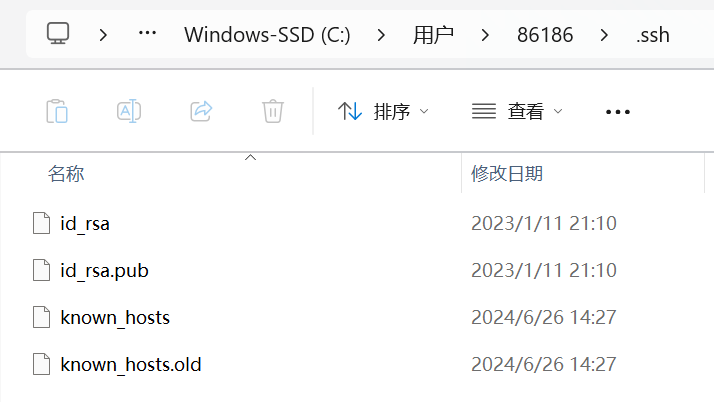
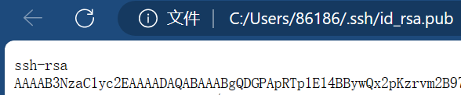
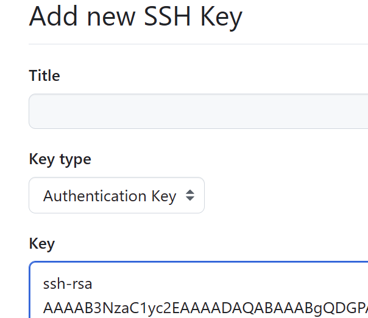
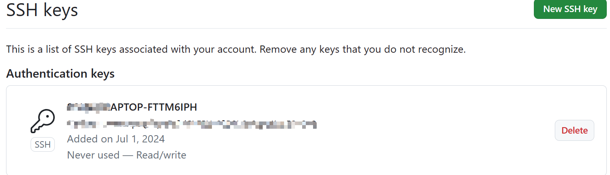
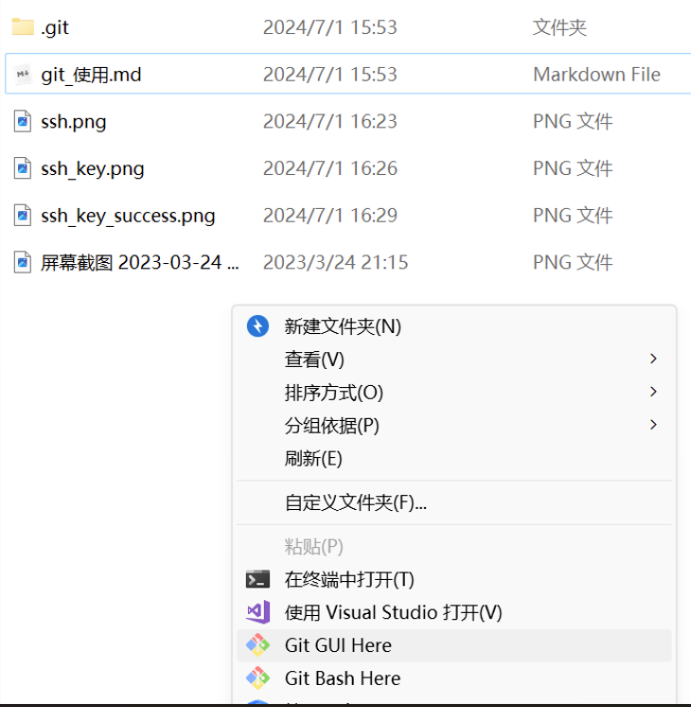
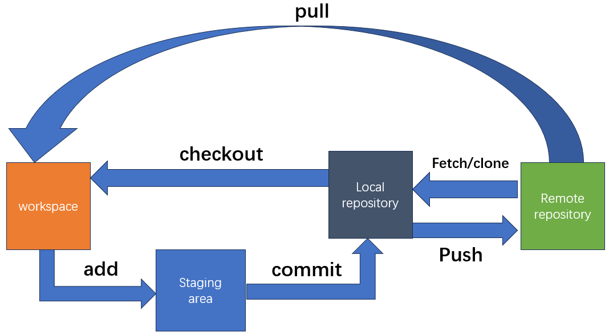
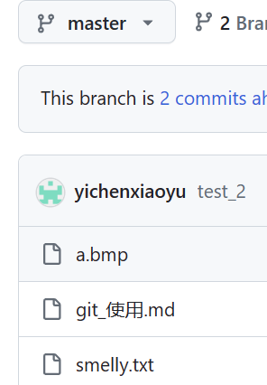
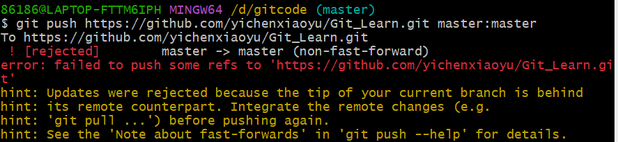

## GIT的配置

~~~python
git config #查看本机是否配置了个人信息
git config --global user.name "……" #定义全局的用户名
git config --global user.email "……" #定义全局的邮件地址
git config --global user.password "……" #配置密码
git config --list #查看本地配置信息
git config --global --list #查看全局配置信息
~~~

## 添加公钥到Github服务器中

1. 配置目的: `pull`,`push`每次都要输入密码，相当的烦。使用 SSH 密钥，可以省去每次都输密码

2. 生成 SSH key 方法：首先确认本地是否已经有该文件，确认 C:\Users\你的用户名.ssh目录下是否有文件 id_rsa 和 id_rsa.pub，如果没有通过以下方法生成：

    运行 `ssh-keygen -t rsa -C "你在github上注册的邮箱"`，在这个目录下就会有需要的两个文件。

添加公钥到 Github 服务器：copy 本地 id_rsa.pub 的内容到 Github 的 Setting 中（我做的时候会自动跳到其他页面，把该页面的内容复制到Github中的SSH Key的key中）具体如图：

添加

结果如下：

自己建立一个文件夹，作为一个Git仓库。使用git bash进入。

## Git的基本使用

### Git工作流程

1. `git init`  
    初始化仓库：  
    
2. `git status`  
    查看当前仓库状态  
    
    
3.  `git add`

    在该文件夹下新建一文本文档命名为smelly.txt ，然后在 Git Bash 命令行窗口的光标处，输入 `git add smelly.txt` 命令，便将 hit.txt 文件添加到 Git 仓库的暂存区。

    但是一般使用的是`gir add .`来将目录中所有文件添加到暂存区。
    
4. `git commit -m "text commit"`

    将暂存区的文件 smelly.txt 提交到了 Git 仓库，其中 commit 表示提交，-m 表示提交信息，双引号""内的是此次提交信息。

    

5. `git log`

    打印Git仓库提交日志

    

    上图所示，显示了我们的提交记录，提交记录的内容包括 Author 提交作者、Date 提交日期和提交信息。

6. `git branch`

    查看Git仓库发分支情况。

    显示了当前仓库中的分支情况，现在仅有一个 master 分支，其中 master 分支前的 ***** 号表示“当前所在的分支”，例如 * master 就意味着我们所在的位置为 demo 仓库的主分支。输入命令 git branch a，再输入命令 git branch，结果如下图所示：

    

7. `git checkout`

    切换分支：eg：`git checkout a`

    也可以在创建分支的同时，直接切换到新的分支：`git checkout -a a`

8. `git merge`

    切换到 master 分支，然后输入 `git merge a` 命令，将 a 分支合并到 master 分支：

    

    将 a 分支合并到主分支。

    **git中的两个分支是否有冲突是什么意思，这是因为什么导致的？**

    在 Git 中，如果两个分支都修改了同一个文件的同一部分，并且尝试将它们合并在一起，就会发生冲突。这种情况下，Git 无法自动决定应该保留哪个更改，因此需要手动解决冲突。

    解决冲突通常需要打开包含冲突的文件，并手动编辑它们，以删除冲突并选择要保留的更改。然后，可以将文件标记为已解决冲突，并将更改提交到 Git 中，以表示解决了冲突。

9. `git branch -d & git branch -D`

    在命令行窗口的光标处，输入 `git branch -d a` 命令，删除 a 分支：

    不过有的时候，通过 `git branch -d` 命令可以出现删除不了现象，例如分支 a 的代码没有合并到主分支等，这时如果一定要删除该分支，那么可以通过命令 `git branch -D` 进行强制删除。

    

10. `git tag`

    为当前分支添加标签`git tag v1.0`：

    

    通过命令 `git tag` 即可查看我们添加标签的记录。通过命令 `git checkout v1.0` 即可切换到该标签下的代码状态。

    

11. `git push <远程仓库地址> <本地分支名>:<远程分支名>`

     如图：

     

     在Github上：
     
     
12. `git clone <远程仓库地址>`

     可以将远程仓库拷贝到本地。

13. 错误：远程分支和本地分支可能完全没有相关，可能本地分支并没有远程的Readme文件。

     

     执行`git pull --rebase <远程仓库地址> master`

     再去推送`git push <地址> master:master`。

