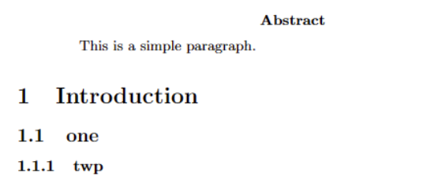
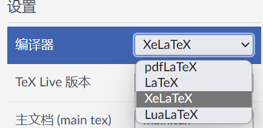
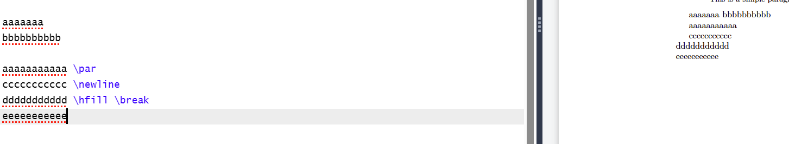
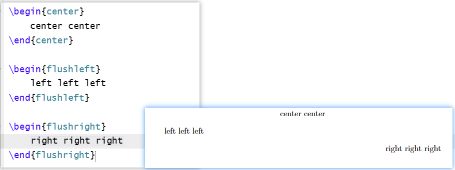

# Latex

1. 一些基本的代码

    + LaTeX提供了多种文档类（document classes）：
    
        article：这是最基本的文档类，用于写作标准的文章或论文。
    
    report：类似于article，但提供了额外的命令来创建报告结构，如章节和附录。
    
        book：用于创建书籍，支持多章节和部分。
    
    ~~~latex
    \documentclass{article}
    \title{title}  % 文章标题
    \author{Name}  % 作者名字
    \date{\today}  % 日期（或输入"\today"直接表示今天日期）
    ~~~
    
2. 书写内容范围

    ~~~latex
    \begin{document}
    % 内容
    \end{document}
    ~~~

3. 标题页

    ~~~latex
    \begin{titlepage}
    \maketitle
    This a title page 
    \end{titlepage}
    ~~~

4. 摘要

    ~~~latex
    \begin{abstract}
    This is a simple paragraph.
    \end{abstract}
    ~~~

5. 标题（一级、二级、、）

    ~~~latex
    \section{Introduction}
    \subsection{one}
    \subsubsection{twp}
    ~~~

    

    

6. 使用中文

    ~~~latex
    \usepackage{xeCJK}
    ~~~

    之后更改设置，将编辑器改为xeCJK

    

7. 换行

    使用的是两个换行，一个不会换行的。还可以使用

    ~~~latex
    \par
    \\
    \newline
    \hfill \break
    ~~~

    在尾部来换行，但是这些都不会产生缩进。

    

8. 换页

    ~~~latex
    \newpage
    ~~~

9. 对齐

    ~~~latex
    \begin{center}
        center center
    \end{center}
    
    \begin{flushleft}
        left left left
    \end{flushleft}
    
    \begin{flushright}
        right right right
    \end{flushright}
    ~~~

    

    

    