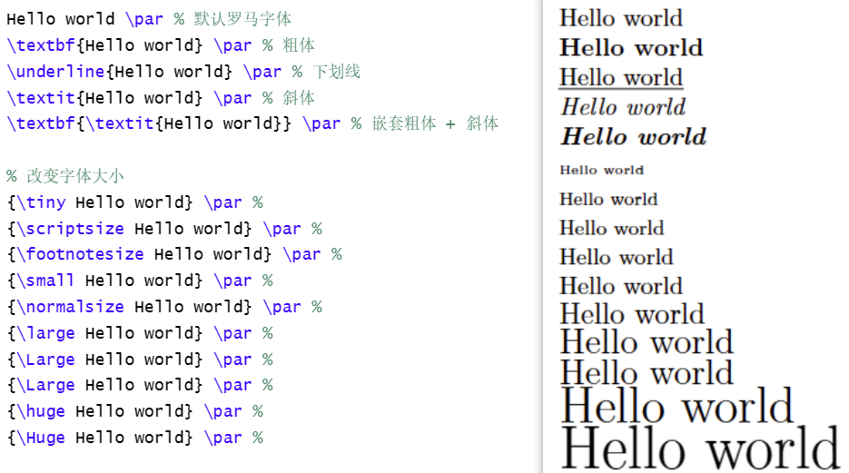
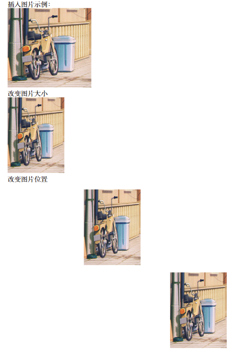
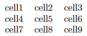
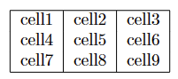
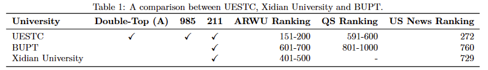

# Latex

1. 一些基本的代码

    + LaTeX提供了多种文档类（document classes）：
    
        article：这是最基本的文档类，用于写作标准的文章或论文。
    
    report：类似于article，但提供了额外的命令来创建报告结构，如章节和附录。
    
        book：用于创建书籍，支持多章节和部分。
    
    ~~~latex
    \documentclass{article}
    \title{title}  % 文章标题
    \author{Name}  % 作者名字
    \date{\today}  % 日期（或输入"\today"直接表示今天日期）
    ~~~
    
2. 书写内容范围

    ~~~latex
    \begin{document}
    % 内容
    \end{document}
    ~~~

3. 标题页

    ~~~latex
    \begin{titlepage}
    \maketitle
    This a title page 
    \end{titlepage}
    ~~~

4. 摘要

    ~~~latex
    \begin{abstract}
    This is a simple paragraph.
    \end{abstract}
    ~~~

5. 标题（一级、二级、、）

    ~~~latex
    \section{Introduction}
    \subsection{one}
    \subsubsection{twp}
    ~~~

    

    

6. 使用中文

    ~~~latex
    \usepackage{xeCJK}
    ~~~

    之后更改设置，将编辑器改为xeCJK

    

7. 换行

    使用的是两个换行，一个不会换行的。还可以使用

    ~~~latex
    \par
    \\
    \newline
    \hfill \break
    ~~~

    在尾部来换行，但是这些都不会产生缩进。

    

8. 换页

    ~~~latex
    \newpage
    ~~~

9. 对齐

    ~~~latex
    \begin{center}
        center center
    \end{center}
    
    \begin{flushleft}
        left left left
    \end{flushleft}
    
    \begin{flushright}
        right right right
    \end{flushright}
    ~~~

    

    

10. 字体

    ~~~latex
    Hello world \par % 默认罗马字体
    \textbf{Hello world} \par % 粗体
    \underline{Hello world} \par % 下划线
    \textit{Hello world} \par % 斜体
    \textbf{\textit{Hello world}} \par % 嵌套粗体 + 斜体
    
    % 改变字体大小
    {\tiny Hello world} \par %  
    {\scriptsize Hello world} \par %
    {\footnotesize Hello world} \par % 
    {\small Hello world} \par %
    {\normalsize Hello world} \par %
    {\large Hello world} \par %
    {\Large Hello world} \par %
    {\Large Hello world} \par %
    {\huge Hello world} \par %
    {\Huge Hello world} \par %
    ~~~

    

11. 插入图片

     ~~~latex
     \usepackage[export]{adjustbox} % 用来改变图片位置
     
     \begin{document}
     插入图片示例：
     
     \includegraphics{eg1}
     
     改变图片大小
     \includegraphics[width=3cm, height=4cm]{eg1}
     \includegraphics[scale=1.5, angle=0]{eg1}  % 图片的放缩比例和旋转
     
     改变图片位置
     
     
     \begin{center}
         \includegraphics[width=3cm, height=4cm]{eg1}
     \end{center}
     \includegraphics[width=3cm, height=4cm, right]{eg1}
     \includegraphics[width=3cm, height=4cm, left]{eg1}
     \includegraphics[width=3cm, height=4cm, center]{eg1}
     
      \end{document}
     ~~~

     

     

     当图片数量多的时候，可以分为两个文件夹进行分类，然后和上面的方式一样直接使用图片名字，可以不使用后缀，它会从这两个文件中找出图片。

     ~~~latex
     \graphicspath{{./images1/}{./images2/}} % 设置两个图片文件夹的路径
     ~~~

12. 文字环绕图片

     ~~~latex
     \usepackage{wrapfig}
     \begin{wrapfigure}{r}{0.25\textwidth} %this figure will be at the right
         \centering
         \includegraphics[width=0.25\textwidth]{图片}
     \end{wrapfigure}
     ~~~

     "__{}__" 中的内容代表一个环境。

     "__r(l or c)__" 图片放置的位置

     "__0.25\textwidth__" 代表图片所占空间的宽度为页面宽度的25%。

     "__width=0.25\textwidth__" 代表图片宽度为页面宽度的25%。

13. 题注

     ~~~latex
     \usepackage{graphicx}
     \begin{figure}[h]
     \caption{题注内容}
     \centering
     \includegraphics[width=0.5\textwidth]{图片}
     \end{figure}
     ~~~

     其中caption在代码中的位置决定了题注的位置。

     __侧方题注__

     ~~~latex
     \usepackage[rightcaption]{sidecap}
     
     \usepackage{graphicx} %package to manage images
     \graphicspath{ {images/} }
     
     \begin{SCfigure}[0.5][h]
     \caption{题注}
     \includegraphics[width=0.6\textwidth]{图片}
     \end{SCfigure}
     ~~~

14. 表格

     __例子__

     ~~~latex
     \begin{center}
     \begin{tabular}{ c c c }
      cell1 & cell2 & cell3 \\
      cell4 & cell5 & cell6 \\
      cell7 & cell8 & cell9    
     \end{tabular}
     \end{center}
     ~~~

     `tabular`环境是LaTeX默认创建表格的环境。你需要对这个环境手动指定一个参数。`{c c c}`参数告诉LaTeX，表格将会有**三列**，每一列都是**居中**对齐（c: center）。

     

     __边界__

     ~~~latex
     \begin{center}
     \begin{tabular}{ |c|c|c| } 
      \hline
      cell1 & cell2 & cell3 \\ 
      cell4 & cell5 & cell6 \\ 
      cell7 & cell8 & cell9 \\ 
      \hline
     \end{tabular}
     \end{center}
     ~~~

     **{ |c|c|c| }**
     这个参数设定了表格中有三列，列旁都有一个竖直的分割线。每一个`c`都代表这一列中的内容是居中对齐的，你也可以使用`r`来向右对齐，或者`l`来向左对齐。

     **\hline**
     这个参数会在表格中插入水平的分割线。你可以多次使用这个命令。

     **cell1 & cell2 & cell3 \\**
     `&`符号分割了单元格之间的内容。`\\`代表着一行的结束。

     

     __三线表__

     ~~~latex
     \documentclass{article}
     \usepackage{graphicx} % 用于\checkmark
     \usepackage{booktabs} % 用于更好的表格线条
     \usepackage{amsmath}   % 有时用于数学环境
     \usepackage{amssymb}
     \usepackage{geometry}
     \geometry{margin=2cm} % 设置所有边距为2厘米
     \begin{document}
     
     \begin{table}[t] % 假设文档是单栏的，使用table而不是table*
         \centering
         \caption{A comparison between UESTC, Xidian University and BUPT.}
         \label{tab:univ-compa}
         \begin{tabular}{lcccrrr}
         \toprule
             \textbf{University} & \textbf{Double-Top (A)} & \textbf{985} & \textbf{211} & \textbf{ARWU Ranking} & \textbf{QS Ranking} & \textbf{US News Ranking} \\ \midrule
             UESTC & \checkmark & \checkmark & \checkmark & 151-200 & 591-600 & 272 \\ 
             BUPT & & & \checkmark & 601-700 & 801-1000 & 760 \\
             Xidian University & & & \checkmark & 401-500 & - & 729 \\ % 使用"-"代替"n/a"
         \bottomrule
         \end{tabular}
     \end{table}
     
     \end{document}
     ~~~

     - `\label{tab:univ-compa}` 为表格创建了一个标签，可以在文档其他部分使用 `\ref{tab:univ-compa}` 来引用这个表格。

     - `\toprule`、`\midrule` 和 `\bottomrule` 来自 `booktabs` 宏包，它们提供了比默认 `\hline` 更优雅的表格线条。`\toprule` 在列标题之上绘制一条粗线，`\midrule` 在行之间绘制一条细线，`\bottomrule` 在表格底部绘制一条粗线。

     - \checkmark 指表格中的"对钩"。

         

         

         

