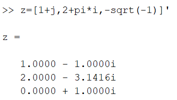
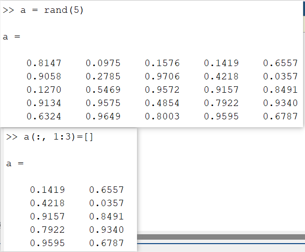

# 关于matlab中的小知识

1. 简单的矩阵输入

    要直接输入矩阵时，矩阵元素用__空格__或__逗号__分隔；矩阵__行__用分号“；”隔离，整个矩阵放在方括号“[ ]”里。 
    A=[1,2,3;4,5,6;7,8,9]↵

    (ps：指令执行后，矩阵 A 被保存在 Matlab 的工作间（workspace）中，以备后
    用。如果用户不用 clear 指令清除它，或对它进行重新赋值，那么该矩阵会一直保存在
    工作间中，直到本 Matlab 指令窗关闭为止。 )

2. 运算结果赋值

    s=1-1/2+1/3-1/4+1/5-1/6+... 
    1/7-1/8;↵
    说明：三个小黑点是“连行号”，分号“；”作用是：指令执行结果将不显示在屏幕
    上，但变量 s 将驻留在内存中。若用户想看 s 的值，可键入以下命令： 
    s↵
    （s= 
    0.6345） 

3. 特殊变量

    ans： 用于结果的缺省变量名 
    pi ：圆周率 
    eps：计算机的最小数 
    flops： 浮点运算次数 
    inf：无穷大 如 1/0 
    NaN：不定量 如 0/0 
    i（j） i=j= −1
    nargin 所用函数的输入变量数目 
    nargout 所用函数的输出变量数目 
    realmin 最小可用正实数 
    realmax 最大可用正实数 
    
4. 向量的共轭转置 

    ~~~matlab
    z=[1+j,2+pi*i,-sqrt(-1)]’
    ~~~

    

5. 产生一个行向量 

  ~~~matlab
  t=[0:0.1:10]         % 产生从 0 到 10 的行向量，元素之间间隔为 0.1 
  t=linspace(n1,n2,n)  % 产生 n1 和 n2 之间线性均匀分布的 n 个数 (缺省 n 时,产生 100 个数) 
  t=logspace(n1,n2,n)  % (缺省 n 时,产生 50 个点) 
  ~~~
  
    
  
6. who 执行该命令可列出工作空间的所有变量； 
    whos 显示所有的变量，变量的元素个数和所占的字节数等； 
    size(a) 执行该命令可以得到矩阵 a 的行数与列数； 
    length(a) 执行该命令后，屏幕上显示出向量 a 的长度。如果 a 是矩阵，则显示的参数为行数列数中的最大者。 

7. 矩阵的下标也可以是向量

    ~~~matlab
    b=a(x,y)↵； % 可以得到一个矩阵 b。a 的行标来自向量 x，而列标来自向量 y。 
    % 例如，矩阵 a 有 n 列， 
    b=a(:,n:-1:1) %将得到矩阵 b，它等于矩阵 a 按列的逆序排列。
    ~~~

8. 特殊矩阵

    * 单位矩阵

        $eye(m)$,$eye(size(a))$ 可以得到与矩阵 $a $同样大小的单位矩阵，$eye(m,n)$可得到一
        个可允许的最大单位矩阵而其余处补0。 

    * 所有元素为 1 的矩阵 
        $ones(n)$，$ones(size(a))$，$ones(m，n) $

    * 所有元素为 0 的矩阵 
        $zeros(n)$，$zeros(m,n) $

    * 空矩阵是一个特殊矩阵,这在线性代数中是不存在的。 
        例如: $q=[ ] $
        矩阵 $q $在工作空间之中,但它的大小为零。通过空矩阵的办法可以删去行与列。例
        如 
        $a=rand(5)$； $a(:,1:3)=[] $
        第一条指令执行后得到一个$5× 5$ 的矩阵；第二条指令将矩阵 $a$ 的前三列删除。 

        

    * 对角矩阵 
        当 $v$ 是向量时，$diag(v)$得到以 v 的元素为对角线上元素的对角矩阵； 
        当 $v$是矩阵时，$diag(v)$ 得到一个列向量，其元素为矩阵 v 对角线上的元素，
        $diag(v,1)$得到矩阵 $v$ 对角线上移一行的元素组成的列向量，
        $diag(v,-1)$得到矩阵 $v$ 对角线下移一行的元素组成的列向量。

