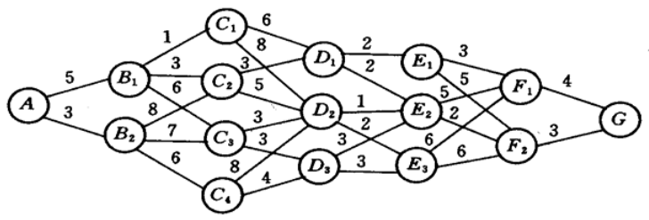
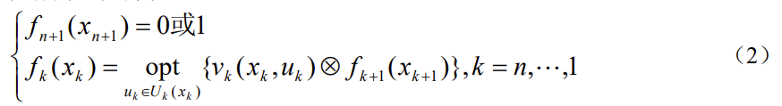
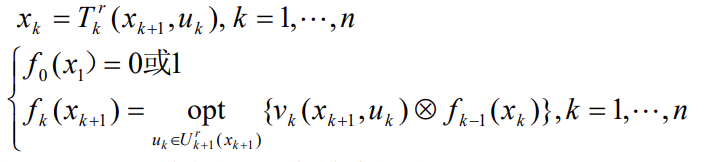

# 动态规划

​		动态规划是求解某类问题的一种方法，是考察问题的一种途径，而不是一种特殊算法（如线性规划是一种算法）。因而，它不象线性规划那样有一个标准的数学表达式和明确定义的一组规则，而必须对具体问题进行具体分析处理。因此，在学习时，除了要对基本概念和方法正确理解外，应以丰富的想象力去建立模型，用创造性的技巧去求解。
​		虽然动态规划主要用于求解以时间划分阶段的动态过程的优化问题，但是一些与时间无关的静态规划（如线性规划、非线性规划），只要人为地引进时间因素，把它视为多阶段决策过程，也可以用动态规划方法方便地求解。

## 一些经典问题

1. 最短路线问题

    下图是一个线路网，连线上的数字表示两点之间的距离（或费用）。试寻求一条由$A$到$G$距离最短（或费用最省）的路线。

    
    		阶段按过程的演变划分，状态由各段的初始位置确定，决策为从各个状态出发的走向，即由$x_{k+1}=u_k(x_k)$，阶段指标为相邻两段状态间的距离$d_k(x_k,u_k(x_k))$，指标函数为阶段指标之和，最优值函数$f_k(x_k)$是由$x_k$出发到终点的最短距离，基本方程为：
    $$
    f_k(x_k)=\min[d_k(x_k,u_k(x_k))+f_{k+1}(x_{k+1})],k=n,...,1;\\
    f_{n+1}(x_{n+1})=0.
    $$
    ​		利用这个模型可以计算出最短路径为$AB_1C_2D_1E_2F_2G$，相应的最短路径为18。

2. 生成计划问题

    工厂生产某种产品，每单位（千件）的成本为 1（千元），每次开工的固定成本为 3
    （千元），工厂每季度的最大生产能力为 6（千件）。经调查，市场对该产品的需求量第
    一、二、三、四季度分别为 2，3，2，4（千件）。如果工厂在第一、二季度将全年的需
    求都生产出来，自然可以降低成本（少付固定成本费），但是对于第三、四季度才能上
    市的产品需付存储费，每季每千件的存储费为 0.5（千元）。还规定年初和年末这种产品
    均无库存。试制定一个生产计划，即安排每个季度的产量，使一年的总费用（生产成本
    和存储费）最少。

## 求解方法

如果一个问题能用动态规划方法求解，那么，可以按下列步骤，首先建立起动态规划的数学模型：
（i）将过程划分成恰当的阶段。
（ii）正确选择状态变量 $x_k$ ，使它既能描述过程的状态，又满足无后效性，同时确定允许状态集合 $X_k$ 。 
（iii）选择决策变量$u_k$ ，确定允许决策集合 $U_k(x_k)$ 。
（iv）写出状态转移方程。
（v）确定阶段指标$v_k(x_k,u_k)$ 及指标函数$V_{kn}$ 的形式（阶段指标之和，阶段指标之积，阶段指标之极大或极小等）。
（vi）写出基本方程即最优值函数满足的递归方程，以及端点条件。

## 一些概念

1.  **阶段**
    		阶段(step)是对整个过程的自然划分。通常根据时间顺序或空间顺序特征来划分阶段，以便按阶段的次序解优化问题。阶段变量一般用$k = 1,2,...,n $表示。在例$1$ 中由$ A$出发为$k = 1$，由 $B_i (i = 1,2)$  出发为 $k = 2$ ，依此下去从 $F_i (i = 1,2)$  出发为 $k = 6$ ，共$n = 6$个阶段。在例 2 中按照第一、二、三、四季度分为$k = 1,2,3,4$，共四个阶段。

2. **状态**
            状态表示每个阶段开始时过程所处的自然状况。它应能描述过程的特征并且无后效性，即当某阶段的状态变量给定时，这个阶段以后过程的演变与该阶段以前各阶段的状态无关。通常还要求状态是直接或间接可以观测的。
            描述状态的变量称状态变量（state variable）。变量允许取值的范围称允许状态集合
    (set of admissible states)。用 $x_k$ 表示第$k$ 阶段的状态变量，它可以是一个数或一个向量。
    用 $X_k$ 表示第 $k $ 阶段的允许状态集合。在例 $1$ 中 $x_2$ 可取 $B_1 ,B_2$ ，或将 $B_i$ 定义为$i(i = 1,2) $，则 $x_2 =1$ 或 $2$ ，而 $X_2={1,2}$ 。
            $n$ 个阶段的决策过程有$n +1$个状态变量， $x_{n+1} $表示 $x_n$ 演变的结果。在例 1 中 $x_7$ 取$G$ ，或定义为$1$，即$ x_7 = 1$。
            根据过程演变的具体情况，状态变量可以是离散的或连续的。为了计算的方便有时将连续变量离散化；为了分析的方便有时又将离散变量视为连续的。
            状态变量简称为状态。

3. **决策**
            当一个阶段的状态确定后，可以作出各种选择从而演变到下一阶段的某个状态，这种选择手段称为决策$（decision）$，在最优控制问题中也称为控制$（control）$。描述决策的变量称决策变量$（decision variable）$，变量允许取值的范围称允许决策集合。用 $u_k(x_k) $ 表示第 $k$ 阶段处于状态 $x_k$ 时的决策变量，它是 $x_k$ 的函数，用$U_k(x_k)$ 表示 $x_k$ 的允许决策集合。在例 1 中$u_ 2(B_1)$可取 $C_1 ,C_2$ 或$C_3$ ，可记作  $u_2(1) =1,2,3 $，而 $U_2(1) ={1,2,3} $。
    决策变量简称决策。

4. **策略**
           决策组成的序列称为策略。由初始状态 $x_1$ 开始的全过程的策略记作$p_{1n}(x_1)$  ，即
    $$
    p_{1n}(x_1) = \{u_1(x_1), u_2(x_2), ..., u_n(x_n)\}
    $$
    由第 $k$ 阶段的状态 $x_k$ 开始到终止状态的后部子过程的策略记作 $p_{kn}(x_k)$ ，即
    $$
    p_{kn}(x_k) = \{u_k(x_k), ..., u_n(x_n)\} ，k = 1,2,..., n−1.
    $$
    类似地，由第 $k$ 到第 $j$ 阶段的子过程的策略记作
    $$
    p_{kj}=\{u_k(x_k),...,u_j(x_j)\}
    $$
    可供选择的策略有一定的范围，称为允许策略集合，用$P_{1n}(x_1),P_{kn},P_{kj}(x_k)$表示。

5. **状态转移方程**
            在确定性过程中，一旦某阶段的状态和决策为已知，下阶段的状态便完全确定。用状态转移方程表示这种演变规律，写作$x_{k+1}=T_k(x_k,u_k),k=1,2,...,n$。在例 1 中状态转移方程为$x_{k+1}=T_k(x_k,u_k),k=1,2,...,n$.
    
6. **指标函数和最优值函数**
            指标函数是衡量过程优劣的数量指标，它是定义在全过程和所有后部子过程上的数量函数，用 $V_{k,n}(x_k, u_k ,x_{k+1}, ...,x_{n+1})$表示，$k = 1,2,...,n$ 。指标函数应具有可分离性，即$V_{k ,n}$可表为 $x_k,u_k,V_{k+1,n}$ 的函数，记为
    $$
    V_{k,n}(x_k,u_k,x_{k+1},...x_{n+1})=\phi_k(x_k,u_k,V_{k+1}(x_{k+1},...,x_{n+1}))
    $$
    并且函数$\phi_k$ 对于变量$V_{k+1,n}$ 是严格单调的。
            过程在第 $j$ 阶段的阶段指标取决于状态 $x_j$和决策$u_j$ ，用$ v_j(x_j,u_j)$ 表示。指标函
    数由$v_j( j=1,2, ...,n)$ 组成，常见的形式有：
            阶段指标之和：
    $$
    V_{k,n}(x_k,u_k,x_{k+1},...x_{n+1})=\sum_{j=k}^nv_j(x_j,u_j)
    $$
    ​        阶段指标之极：
    $$
    V_{k,n}(x_k,u_k,x_{k+1},...x_{n+1})=\prod_{j=k}^nv_j(x_j,u_j)
    $$
    ​       阶段指标之极大（极小），即
    $$
    V_{k,n}(x_k,u_k,x_{k+1},...x_{n+1})=\max_{k\le j\le n}(\min)v_j(x_j,u_j)
    $$
    ​       根据状态转移方程指标函数$V_{k ,n}$ 还可以表示为状态 $x_k$ 和策略 $p_{kn}$的函数，即
    $V_{k,n}(x_k,p_{kn})$ 。在 $x_k$ 给定时指标函数$V_{k ,n}$对 $p_{kn}$ 的最优值称为最优值函数 ，记为
    $f_k(x_k)$ ，即
    $$
    f_k(x_k)=opt \ V_{k,n}(x_k,p{kn}),
    $$
    其中opt 可根据具体情况取 $\max$ 或 $\min$ 。
    
7. 最优策略和最优轨线
        使指标函数$V_{k ,n}$ 达到最优值的策略是从 $k$ 开始的后部子过程的最优策略，记作$p_{kn}^*=\{u_k^*,...,u_n^*\}$ 是全过程的最优策略，简称最优策略。从初始状态$x_1(=x_1^*)$出发，过程按照 $p_{1n}^*$ 和状态转移方程演变所经历的状态序列$\{x_1^*,x_2^*,...,x_{n+1}^*\}$称最优轨线。

8. 递归方程

  

  在上述方程中，当$⊗$ 为加法时取 $f_{n+1}(x_{n+1}) = 0$ ；当 ⊗ 为乘法时，取 $f_{n+1}(x_{n+1}) =1$。动态规划递归方程是动态规划的最优性原理的基础，即：最优策略的子策略，构成最优子策略。用状态转移方程（1）和递归方程（2）求解动态规划的过程，是由 $k = n +1$逆推至 $k = 1$故这种解法称为逆序解法。当然，对某些动态规划问题，也可采用顺序解法。这时，状态转移方程和递归方程分别为:

  

  