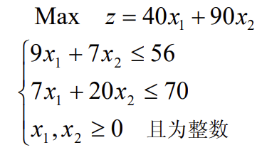
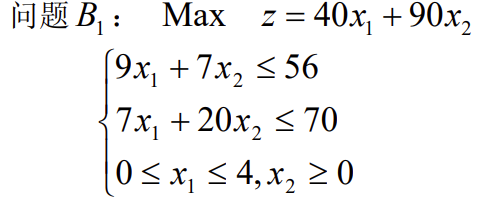
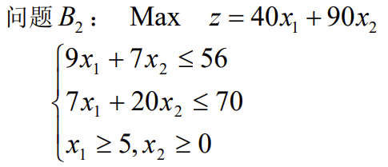

# 整数规划

## 1. 定义

​		规划中的变量（部分或全部）限制为整数时，称为整数规划。若在线性规划模型中，变量限制为整数，则称为整数线性规划。目前所流行的求解整数规划的方法，往往只适用于整数线性规划。目前还没有一种方法能有效地求解一切整数规划。

## 2. 整数规划的分类

​		如不加特殊说明，一般指整数线性规划。对于整数线性规划模型大致可分为两类：
（1）变量全限制为整数时，称纯（完全）整数规划。
（2）变量部分限制为整数的，称混合整数规划。

## 3. 整数规划特点

（i）原线性规划有最优解，当自变量限制为整数后，其整数规划解出现下述情况：
（1）原线性规划最优解全是整数，则整数规划最优解与线性规划最优解一致。
（2） 整数规划无可行解。
eg：原线性规划为
$\min z=x_1+x_2$
$2x_1+4x_2=5, x_1\ge0, x_2\ge0$
其最优可行解为：$x_1=0,x_2=\frac{5}{4},\min z=\frac{5}{4}$。

（3）有可行解（即存在最优解），但最优解值变差。
原线性规划规划为：
$\min z=x_1+x_2$
$2x_1+4x_2=6, x_1\ge0, x_2\ge0$
其最优实数解为：$x_1=0,x_2=\frac{3}{2}, \min z=\frac{3}{2}$
若限制整数得：$x_1=1,x_2=1, \min z=2$

（ii）整数规划最优解不能按照实数最优解简单取整而获得。

## 4. 求解方法分类

（i）  分枝定界法—可求纯或混合整数线性规划。
（ii） 割平面法—可求纯或混合整数线性规划。
（iii）隐枚举法—求解“0-1”整数规划：
		①过滤隐枚举法；
		②分枝隐枚举法。
（iv）匈牙利法—解决指派问题（“0-1”规划特殊情形）。
（v） 蒙特卡洛法—求解各种类型规划。

### 4.1 分支定界法

​		对有约束条件的最优化问题（__其可行解为有限数__）的所有可行解空间恰当地进行系统搜索，这就是分枝与定界内容。通常，把全部可行解空间反复地分割为越来越小的子集，称为分枝；并且对每个子集内的解集计算一个目标下界（对于最小值问题），这称为定界。在每次分枝后，凡是界限超出已知可行解集目标值的那些子集不再进一步分枝，这样，许多子集可不予考虑，这称剪枝。这就是分枝定界法的主要思路。
​		分枝定界法可用于解纯整数或混合的整数规划问题。在本世纪六十年代初由$Land Doig$和 $Dakin$ 等人提出的。由于这方法灵活且便于用计算机求解，所以现在它已是解整数规划的重要方法。目前已成功地应用于求解生产进度问题、旅行推销员问题、工厂选址问题、背包问题及分配问题等。
​		设有最大化的整数规划问题 $A$，与它相应的线性规划为问题$B$ ，从解问题 $B$ 开始，__若其最优解不符合 $A$ 的整数条件，那么 $B$ 的最优目标函数必是 $A$ 的最优目标函数 $z^*$ 的上界，记作 $\overline{z}$ __；而 $A$ 的任意可行解的目标函数值将是 $z^*$ 的一个下界 $\underline{z}$ 。分枝定界法就是将 $B$ 的可行域分成子区域的方法。逐步减小 $\overline{z}$ 和增大 $\underline{z}$ ，最终求到  $z^*$ 。

#### 例子

求解下述整数规划

解：（1）先不考虑整数限制，即解相应的线性规划$B$，得到最优解为：
$x_1=4.8092,x_2=1.8168,z=355.8779$
可见它不符合整数条件。这时 $z$ 是问题 $A$ 的最优目标函数值 $z^*$ 的上界，记作 $\overline{z}$ 。而 $x_1=0, x_2=0$ 显然是问题 $A$ 的一个整数可行解，这时$z = 0$ ，是 $z^*$ 的一个下界，记作 $\underline{z}$ ，即$0\le z^*≤ 356$。  
（2）因为$x_1,x_2$当前均为非整数，故不满足整数要求，任选一个进行分枝。设选$x_1$进行分枝，把可行集分成两个子集：$x_1\le[4.8092]=4,x_1\ge[4.8092]+1=5$
		因为4与5之间无整数，故这两个子集的整数解必与原可行集合整数解一致。这异步称为分枝。这两个子集的规划及求解如下：
		

最优解为：$x_1=4.0,x_2=2.1,z_1=349$。
		

最优解为：$x_1=5.0,x_2=1.57,z_1=341.4$。
		再定界：$0\le z^*\le349$。
（3）对问题$B_1$再进行分枝得到问题$B_11$和$B_12$，他们的最优解为：
	$B_{11}: x_1=4, x_2=2, z_{11}=340$
	$B_{12}: x_1=1.43, x_2=3.00, z_{12}=327.14$
再定界：$340\le z^* \le 341$，并将$B_{12}$剪枝。
（4）对问题$B_2$再进行分枝得到问题$B_{21}$和$B_{22}$，它们的最优解为：
	$B_{21}: x_1=5.44, x_2=1.00, z_{22}=308$
	$B_{22}$无可行解。
将$B_{21},B_{22}$剪枝。
与是可以判定原问题的最优解为：
	$x_1=4,x_2=2,z^*=340$
综上可以将分枝定界法求解整数规划（最大化）问题的步骤为：

​		开始，将要求解的整数规划问题称为问题 $A$ ，将与它相应的线性规划问题称为问题 $B$ 。
（i）解问题 $B$ 可能得到以下情况之一：
（a） $B$ 没有可行解，这时 $A$ 也没有可行解，则停止．
（b） $B$ 有最优解，并符合问题 $A$ 的整数条件，$B$ 的最优解即为 $A$ 的最优解，则
停止。
（c）$B$ 有最优解，但不符合问题 $A$ 的整数条件，记它的目标函数值为 $\underline{z}$ 。
（ii）用观察法找问题 $A$ 的一个整数可行解，一般可取 $x_j = 0, j = 1,...,n$ ，试探，
求得其目标函数值，并记作 $\underline{z}$ 。以 $z^*$ 表示问题 $A$ 的最优目标函数值；这时有
​		$\underline{z} ≤ z^* ≤ \overline{z}$
进行迭代。
​		第一步：分枝，在 $B$ 的最优解中任选一个不符合整数条件的变量 $x_j$ ，其值为$b_j$ ，
以$[b_j]$ 表示小于$b_j$ 的最大整数。构造两个约束条件
​			$x_j\le [b_j] 和 x_j ≥ [b_j] +1$
将这两个约束条件，分别加入问题 $B$ ，求两个后继规划问题 $B_1$ 和 $B_2$ 。不考虑整数条件
求解这两个后继问题。
​		定界，以每个后继问题为一分枝标明求解的结果，与其它问题的解的结果中，找出
最优目标函数值最大者作为新的上界 $\underline{z}$ 。从已符合整数条件的各分支中，找出目标函数
值为最大者作为新的下界 $\underline{z}$ ，若无作用 $\underline{z}$ 不变。
​		第二步：比较与剪枝，各分枝的最优目标函数中若有小于 $\underline{z}$ 者，则剪掉这枝，即
以后不再考虑了。若大于 $\underline{z}$ ，且不符合整数条件，则重复第一步骤。一直到最后得到
$z^* = \underline{z}$ 为止。得最优整数解 $x _j^*, j=1,... , n$。

