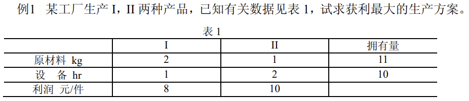
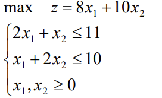
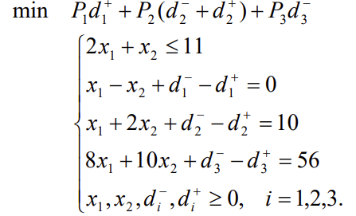
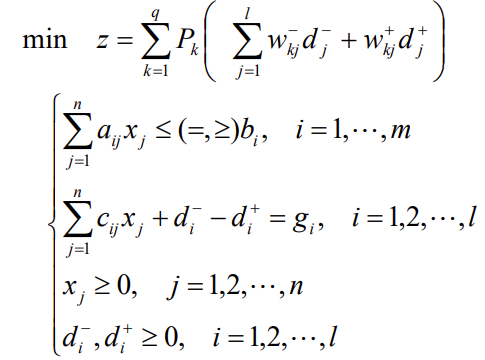

# 目标规划

## 1. 介绍

​		**目标规划**是为了解决多个目标问题而产生的一种数学规划方法，是由线性规划发展演变而来。目标规划和线性规划主要有以下区别：
​		**线性规划**是在一组线性约束条件下，寻求某一单一目标的最优值，只有一个目标函数，但在实际问题中往往要考虑多个目标。
 		**目标规划**模型中的目标函数可以有多个目标可以设置，多个目标之间可能是互相矛盾、相互排斥的，每个目标分别带有不同的优先级和权系数；
​		**线性规划**立足于满足所有约束条件的可行解，而目标规划是在条件下找到满意解,并不一定要满足所有约束，更能运用于实际生活中。

## 2. 分类

​		目标规划包括线性目标规划，非线性目标规划，整数线性目标规划，整数非线性目标规划等。

## 3. 求解思路

（1）加权系数法
		为每一目标赋一个权系数，把多目标模型转化成单一目标的模型。但困难是要确定合理的权系数，以反映不同目标之间的重要程度。
（2）优先等级法
		将各目标按其重要程度不同的优先等级，转化为单目标模型。
（3）有效解法
		寻求能够照顾到各个目标，并使决策者感到满意的解。由决策者来确定选取哪一个解，即得到一个满意解。但有效解的数目太多而难以将其一一求出。

## 4. 目标规划的数学模型

解：这是一个单目标规划问题。设生产产品$I,II$的量分别为$x_1,x_2$时获利最大，建立如下线性规划模型：

则最优决策方案为：$x_1^*=4,x_2^*=3,z^*=62$。
但实际上工厂在作决策方案时，要考虑市场等一系列其它条件。如：
（i）根据市场信息，产品 $I$ 的销售量有下降的趋势，故考虑产品 $I $ 的产量不大于
产品 $II$。
（ii）超过计划供应的原材料，需要高价采购，这就使成本增加。
（iii）应尽可能充分利用设备，但不希望加班。
（iv）应尽可能达到并超过计划利润指标 56 元。

​		这样在考虑产品决策时，便为多目标决策问题。目标规划方法是解决这类决策问题的方法之一。下面引入与建立目标规划数学模型有关的概念。

1. 正、负偏差变量
          设 $d$ 为决策变量的函数，正偏差变量 $d^+=\max\{d-d_0 ,0\}$表示决策值超过目标值的部分，负偏差变量 $d^-=\min\{d-d_0 ,0\}$表示决策值未达到目标值的部分，这里$d_0$ 表示 $d$ 的目标值。因决策值不可能既超过目标值同时又未达到目标值，即恒有$d^+× d^-= 0$。
     
2. 绝对（刚性）约束和目标约束
        绝对约束是指必须严格满足的等式约束和不等式约束；如线性规划问题的所有约束条件，不能满足这些约束条件的解称为非可行解，所以它们是硬约束。目标约束是目标规划特有的，可把约束右端项看作要追求的目标值。在达到此目标值时允许发生正或负偏差，因此在这些约束中加入正、负偏差变量，它们是软约束。线性规划问题的目标函数，在给定目标值和加入正、负偏差变量后可变换为目标约束。也可根据问题的需要将绝对约束变换为目标约束。如：例 1 的目标函数 $`z = 8x_1 +10x_2$ 可变换为目标约束$8x_1+10x_2 + d_1^- − d_1^+ = 56$。绝对约束 $2x_1+ x_2 ≤11$ 可变换为目标约束$2x_1+x_2+ d_2^-− d_2^+ = 11$。
   
3. 优先因子（优先等级）与权系数
        一个规划问题常常有若干目标。但决策者在要求达到这些目标时，是有主次或轻重缓急的不同。凡要求第一位达到的目标赋于优先因子 $P_1$，次位的目标赋于优先因子$P_2$,$L$，并规定 $P_k >> P_{k+1} , k = 1,2,...,q$ 。表示 $P_k$ 比 $P_{k +1}$有更大的优先权。以此类推，若要区别具有相同优先因子的两个目标的差别，这时可分别赋于它们不同的权系数 $w_j$ ，这些都由决策者按具体情况而定。
   
4. 目标规划的目标函数
          目标规划的目标函数（准则函数）是按各目标约束的正、负偏差变量和赋于相应的优先因子而构造的。当每一目标值确定后，决策者的要求是尽可能缩小偏离目标值。因此目标规划的目标函数只能是 $\min z = f(d^+, d^-)$ 。其基本形式有三种：
    （1）要求恰好达到目标值，即正、负偏差变量都要尽可能地小，这时
          $\min z = f(d^+ + d^-)$
    （2）要求不超过目标值，即允许达不到目标值，就是正偏差变量要尽可能地小，这时
          $\min z = f(d^+)$
    （3）要求超过目标值，即超过量不限，但必须是负偏差变量要尽可能地小，这时
          $\min z = f(d^-)$
    对每一个具体目标规划问题，可根据决策者的要求和赋于各目标的优先因子来构造目标
    函数，以下用例子说明。
    
    ​        例 2： 例 1 的决策者在原材料供应受严格限制的基础上考虑：首先是产品 II 的产量不低于产品 I 的产量；其次是充分利用设备有效台时，不加班；再次是利润额不小于56 元。求决策方案。
    ​           解：按决策者所要求的，分别赋于这三个目标 1 2 3 P ,P ,P 优先因子。这问题的数学模型是
    
    
5. 目标规划的一般数学模型
  设 $x_j ( j = 1,2,...,n )$是目标规划的决策变量，共有 $m$ 个约束是刚性约束，可能是等式约束，也可能是不等式约束。设有$l$ 个柔性目标约束，其目标规划约束的偏差为$ d_i^+, d_i^- (i = 1,2,...,l )$。设有 $q$ 个优先级别，分别为 $P_1, P_2,..., P_q $ 。在同一个优先级 $P_k$中，有不同的权重，分别记为 $w_{kj}^+ ,w_{kj}^- ( j=1,2, ...,l)$ 。因此目标规划模型的一般数学表
  达式为
  
          建立目标规划的数学模型时，需要确定目标值、优先等级、权系数等，它们都具有
  一定的主观性和模糊性，可以用专家评定法给以量化。
  

## 5. 求解目标规划的序贯式算法

​        序贯式算法是求解目标规划的一种早期算法，其核心是根据优先级的先后次序，将目标规划问题分解成一系列的单目标规划问题，然后再依次求解。
​		求解目标规划的序贯算法
​		对于 $k = 1,2,..., q$ ，求解单目标规划
$$
\min z=\sum_{j=1}^{l}(w_{kj}^-d_j^-+w_{kj}^+d_j^+) \\
s.t \ \sum_{j=1}^{n}a_{ij}\le(=,\ge)b_i, \ i=1,...,m \\
\sum_{j=1}^{n}c_{ij}x_j+d_i^--d_i^+=g_i, \ i=1,...,l \\
\sum_{j=1}^{n}(w_{sj}^-d_j^-+w_{sj}^+d_j^+)\le z_s^*, \ s=1,2,...,k-1, \\
x_j \ge 0, j=1,2,...,n \\
d_i^-,d_i^+ \ge 0, i=1,2,...,l
$$
​        其最优目标值为 $z_k^*$ ，当 $k = 1$时，约束（4）为空约束。当 $k = q$ 时，$z_q^*$ 所对应的解 $x^*$ 为目标规划的最优解。
​        注：此时最优解的概念与线性规划最优解的概念已有所不同，但为方便起见，仍称为最优解

​    

