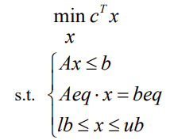
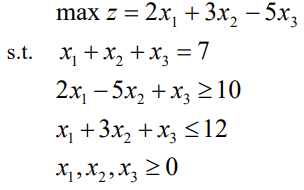

## 线性规划

​        在人们的生产实践中，经常会遇到如何利用现有资源来安排生产，以取得最大经济
效益的问题。此类问题构成了运筹学的一个重要分支—数学规划，而__线性规划__(Linear 
Programming 简记 LP)则是数学规划的一个重要分支。自从 1947 年 G. B. Dantzig 提出
求解线性规划的单纯形方法以来，线性规划在理论上趋向成熟，在实用中日益广泛与深
入。特别是在计算机能处理成千上万个约束条件和决策变量的线性规划问题之后，线性
规划的适用领域更为广泛了，已成为现代管理中经常采用的基本方法之一。

 		一个典型的线性规划模型包含:

1. 一个线性的__目标函数__,例如最大化利润或者最小化成本。 
2. 一些线性的不等式__约束条件__(s.t，即subject to),如资源限制等。
3. 一些线性等式约束条件。
4. 所有的决策变量都必须是__非负实数__。

由于上面的目标函数及约束条件均为线性函数，故被称为线性规划问题

## 线性规划解的概念

1. 内点解：满足所有的__等式约束__和__非等式约束__的解,位于可行区域内部。

2. 边界点解：满足所有约束,但至少有一个约束作为等号成立,位于__可行区域边界__上。

3. 可行解：满足所有约束条件但可能不达到目标函数的最优值。就等于内点解和边界点解。

4. 最优解：使__目标函数__达到最大的可行解。

5. 非可行解：违背了某些约束,不属于可行区域。

6. 无效域解：参数取值域外无法达成的解。

7. 无限解；目标函数和约束条件都无限取值,没有最大最小点。

## matlab中线性规划的解法

$Matlab$中线性规划的标准型为：

		基本函数形式为 $linprog(c,A,b)$，它的返回值是向量 $x$ 的值。还有其它的一些函数调用形
式（在 $Matlab$ 指令窗运行 $help\ linprog$ 可以看到所有的函数调用形式），如：
**$[x,fval]=linprog(c,A,b,Aeq,beq,LB,UB,X0,OPTIONS)$** 这里 $fval$返回目标函数的最小值，$c$目标函数的系数向量，$A$不等式约束矩阵，$B$不等式约束向量，$Aeq$等式约束向量，$beq$等式约束矩阵，$LB$和 $UB$ 分别是变量 $x$ 的下界和上界， $x_0$ 是 $x$ 的初始值，$OPTIONS$ 是控制参数。 
$eg:$求解下列线性规划问题。

解：（1）编写$line$文件：

~~~matlab
c=[2;3;-5];
a=[-2,5,-1;1,3,1]; b=[-10;12];
aeq=[1,1,1];
beq=7;
x=linprog(-c,a,b,aeq,beq,zeros(3,1))
value=c'*x
~~~

（2）将$line$文件保存，并命名为$line.m$
（3）运行文件（也可以在指令窗口运行）

​    

