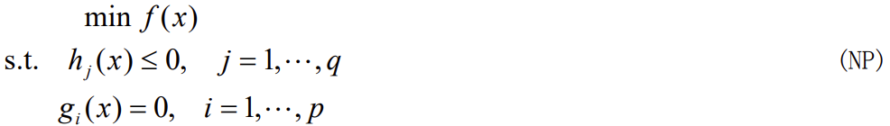
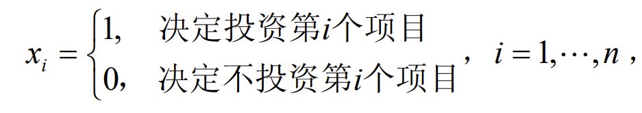
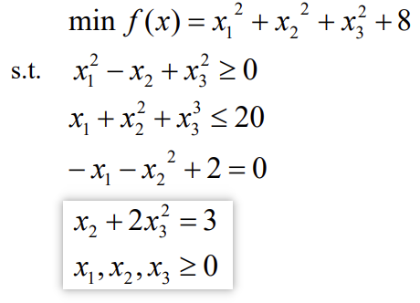

# 非线性规划

​		如果目标函数或约束条件中包含非线性函数，就称这种规划问题为非线性规划问
题。一般说来，解非线性规划要比解线性规划问题困难得多。而且，也不象线性规划有
单纯形法这一通用方法，非线性规划目前还没有适于各种问题的一般算法，各个方法都
有自己特定的适用范围。

# 1.决策投资问题

## 1.1  定义

在一组等式或不等式的约束下，求一个函数的最大值（或最小值）问题，其中至少有一个非线性函数，这类问题称为非线性规划问题。一般形式：

其中$x=[x_1  ...  x_n]^T$称为模型(NP)的决策变量，$f$称为目标函数，$g_i(i=1,...,p)$和$h_i(i=1,...,p)$称为约束函数。另外，$g_i(x)=0 (i=1,...,p)$称为等式约束，而$h_i$称为不等式约束。

​		对于一个实际问题，在把它归结成非线性规划问题时，一般需要注意几点：

（1） 确定供选方案：首先要收集同问题有关的资料和数据，在全面熟悉问题的基础上，确认什么是问题的可供选择的方案，并用一组变量来表示它们。

（2） 提出最求目标：经过资料分析，根据实际需要和可能，提出要最求极小化或极大化的目标。并且，运用各种科学和技术原理，把他们表示成数学关系式。

（3） 给出价值标准：在提出最求的目标之后，要确立所考虑目标的“好”或“坏”的价值标准，并用某种数量形式来描述它。

（4） 寻求限制条件：由于所追求的目标一般都要在一定的条件下取得极小化或极大化效果，因此还需要寻找出问题的所有限制条件，这些条件通常用变量之间的一些不等式或等式来表示。 

## 1.2. 线性规划与非线性规划的区别

如果线性规划的最优解存在，其最优解只能在其可行域的边界上达到（特别是可行域的顶点上达到）；而非线性规划的最优解（如果最优解存在）则可能在其可行域的任意一点达到。

## 1.3 例子（会用matlab写出，还会放在同文件夹下）

某企业有n个项目可供选择投资，并且至少要对其中一个项目投资。已知该企业拥有总资金A元，投资与第$i(i=1,...,n)$个项目需要花资金$a_i$元，并预计可收益$b_i$元。试选择最佳投资方案。

解：设投资决策变量为：

则投资总额为$\sum_{i=1}^{n}a_ix_i$，投资总收益为$\sum_{i=1}^{n}b_ix_i$。因为该公司至少要对一个项目投资，并且总的投资金额不能超过总资金$A$，所以有限制条件：

$0<\sum_{i=1}^{n}a_ix_i<A$

另外，由于$x_i$只能取值$0$或$1$，所以还有：

$x_i(1-x_i)=0,i=1,...,n$

​		最佳投资方案应是投资额最小而总收益最大的方案，所以最佳投资决策问题归结为总资金已经总决策变量（取0或1）的限制条件下，极大化总收益和总投资之比。所以其数学模型：

$\max Q=\frac{\sum_{i=1}^{n}b_ix_i}{\sum_{i=1}^{n}a_ix_i}$

$s. t.        0<\sum_{i=1}^{n}a_ix_i<A$

$x_i(1-x_i)=0,i=1,...,n$

使用一个具体的例子：

求下列非线性规划

解：（1） 编写 M 文件 fun1.m 定义目标函数 

~~~matlab
function f=fun1(x);
f=sum(x.^2)+8;
~~~

（2）编写M文件fun2.m定义非线性约束条件

~~~matlab
function [g,h]=fun2(x); 
g=[-x(1)^2+x(2)-x(3)^2 
x(1)+x(2)^2+x(3)^3-20]; %非线性不等式约束
h=[-x(1)-x(2)^2+2 
x(2)+2*x(3)^2-3]; %非线性等式约束
~~~

（3）编写主程序文件 main1.m 如下： 

~~~matlab
options=optimset('largescale','off'); 
[x,y]=fmincon('fun1',rand(3,1),[],[],[],[],zeros(3,1),[], ... 'fun2', options) 
~~~

运行主程序文件，得到结果：

就可以求得当 $x1 = 0.5522$, $x2 =1.2033$, $x3 = 0.9478$ 时，最小值 $y =10.6511$。 

