# 图论

## 1. 经典问题

+ 最短路径问题$(SPP－shortest path problem)$
&emsp;&emsp;一名货柜车司机奉命在最短的时间内将一车货物从甲地运往乙地。从甲地到乙地的公路网纵横交错，因此有多种行车路线，这名司机应选择哪条线路呢？假设货柜车的运行速度是恒定的，那么这一问题相当于需要找到一条从甲地到乙地的最短路。
+ 公路连接问题
&emsp;&emsp;某一地区有若干个主要城市，现准备修建高速公路把这些城市连接起来，使得从其中任何一城市都可以经高速公路直接或间接到达另一个城市。假定已经知道了任意个城市之间修建高速公路的成本，那么应如何决定在哪些城市间修建高速公路，使得总成本最小？
+ 指派问题$(assignment problem)$
&emsp;&emsp;一家公司经理准备安排$N$名员工去完成$N$项任务，每人一项。由于各员工的特点不同，不同的员工去完成同一项任务时所获得的回报是不同的。如何分配工作方案可以使总回报最大？
+ 中国邮递员问题$(CPP－chinese postman problem)$
&emsp;&emsp;一名邮递员负责投递某个街区的邮件。如何为他（她）设计一条最短的投递路线（从邮局出发，经过投递区内每条街道至少一次，最后返回邮局）？由于这一问题是我国管梅谷教授 1960 年首先提出的，所以国际上称之为中国邮递员问题。
+ 旅行商问题$(TSP－traveling salesman problem)$
&emsp;&emsp;一名推销员准备前往若干城市推销产品。如何为他（她）设计一条最短的旅行路线（从驻地出发，经过每个城市恰好一次，最后返回驻地）？这一问题的研究历史十分悠久，通常称之为旅行商问题。
+ 运输问题$(transportation problem)$
&emsp;&emsp;某种原材料有$M$个产地，现在需要将原材料从产地运往$N$个使用这些原材料的工厂。假定$M$个产地的产量和$N$家工厂的需要量已知，单位产品从任一产地到任一工厂的运费已知，那么如何安排运输方案可以使总运输成本最低？

​       上述问题有两个共同的特点：一是它们的目的都是从若干可能的安排或方案中寻求某种意义下的最优安排或方案，数学上把这种问题称为最优化或优化$(optimization)$问题；二是它们都易于用图形的形式直观地描述和表达，数学上把这种与图相关的结构称为网络$(network)$。与图和网络相关的最优化问题就是网络最优化或称网络优化$(netwok optimization)$问题。所以上面例子中介绍的问题都是网络优化问题。由于多数网络优化问题是以网络上的流$(flow)$为研究的对象，因此网络优化又常常被称为网络流$(network flows)$或网络流规划等。

## 图的基础

### 1. 无向图

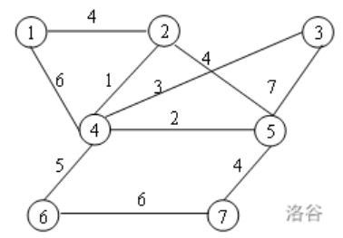
    
两个顶点之间如果有边连接，那么就视为两个顶点相邻
路径：相邻顶点的序列
圈：起点和终点重合的路径
连通图：任意两点之间都有路径连接的图    
度：顶点连接的边数叫做这个顶点的度
树：没有圈的连通图    
森林：没有圈的非连通图    
边上赋权的无向图称为赋权无向图或无向网络    
**有限图**:  顶点集和边集都有限。
**简单图**$(simple graph)$: 既没有环也没有两条边连接同一对顶点。

###2. 有向图

&emsp;&emsp;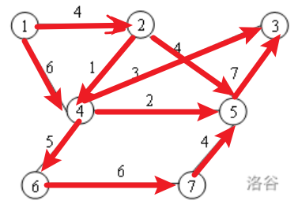
    
&emsp;&emsp;在有向图中，边是单向的：每条边所连接的两个顶点是一个有序对，他们的邻接性是单向的
&emsp;&emsp;有向路径：相邻顶点的序列
&emsp;&emsp;**有向环**：一条至少含有一条边且起点和终点相同的有向路径
&emsp;&emsp;**有向无环图**$(DAG)$：没有环的有向图
&emsp;&emsp;**度**：一个顶点的入度与出度之和称为该顶点的度
&emsp;&emsp;**入度**：以顶点为弧头的边的数目称为该顶点的入度
&emsp;&emsp;**出度**：以顶点为弧尾的边的数目称为该顶点的出度

###3. 完全图、二分图

&emsp;&emsp;每一对不同的顶点都有一条边相连的简单图称为**完全图**$(complete graph)$。$n$个顶点的完全图记为$K_n$ 。
&emsp;&emsp;若$V(G) = X \cup Y ， X \cap Y =\emptyset ，| X ||Y | \neq 0$（这里$| X |$表示集合$X$中的元素个数），$X$中无相邻顶点对，$Y$中亦然，则称$G$为二分图$(bipartite graph)$；特别地，若$\forall x \in X$,$\forall y \in Y$，则$xy \in E(G)$，则称$G$为完全二分图，记成$K_{|X |,|Y |}$ 。即顶点可以被分为两个互不相交的集合，使得图中的每条边都连接这两个集合中的顶点，即没有两个顶点属于同一个集合且由边相连。

###4. 子图

&emsp;&emsp;图$H$叫做图$G$的子图（subgraph），记作$H \subset G$，则有$V(H) \subset V(G)$ ，$E(H) \subset E(G)$。若$H$是$G$的子图，则$G$称为$H$的母图。
&emsp;&emsp;$G$的支撑子图（spanning subgraph，又成生成子图）是指满足$V(H) =V(G)$的子图$H $。

###5. 顶点的度

&emsp;&emsp;设$v\in V(G)$ ，$G$中与$v$关联的边数（每个环算作两条边）称为$v$的度(degree)，记作$d(v)$。若$d(v)$是奇数，称$v$是奇顶点$(odd point)$；$d(v)$是偶数，称$v$是偶顶点$(even point)$。关于顶点的度，我们有如下结果：
&emsp;(i)$\sum_{v \in V}d(v) =2\epsilon$  (度数是边数的两倍)
&emsp;(ii) 任意一个图的奇顶点的个数是偶数。

### 6. 数据结构

&emsp;&emsp;假设$G = (V, A)$是一个简单有向图，$|V |= n,| A|= m$，并假设$V$中的顶点用自然数$1,2,...,n$表示或编号，$A$中的弧用自然数1,2,...,$m$表示或编号。

(1) 邻接矩阵表示法
&emsp;&emsp;图$G=(V,A)$的邻接矩阵是如下定义的：
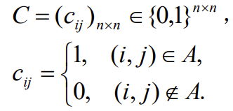

&emsp;&emsp;也就是说如果两点之间有一条弧，则邻接矩阵中对应的元素为1，否则为0。这种方法简单、直接，但是当网络比较稀疏的时候，需要浪费大量的存储空间，增加查找时间。
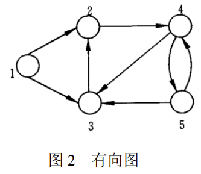
对于图2表示的有向图，可以用邻接矩阵表示
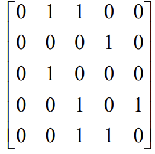
(2) 关联矩阵表示法
对于$G=(V,A)$ 的关联矩阵$B$是如下定义的：
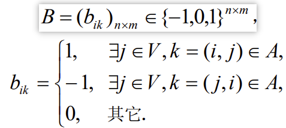

&emsp;&emsp;也就是说，在关联矩阵中，每行对应于图的一个节点，每列对应于图的一条弧。如果一个节点是一条弧的起点，则关联矩阵中对应的元素为 1；如果一个节点是一条弧的终点，则关联矩阵中对应的元素为 -1；如果一个节点与一条弧不关联，则关联矩阵中对应的元素为 0。这种表示法也非常简单、直接。但是，在关联矩阵的所有$nm$个元素中，只有$2m$个为非零元。如果网络比较稀疏，这种表示法也会浪费大量的存储空间。
&emsp;&emsp;对于图2所示的图，如果关联矩阵中每列对应弧的顺序为$(1,2)，(1,3)，(2,4)，(3,2)$，$(4,3)，(4,5)，(5,3)$和$(5,4)$，则关联矩阵表示为

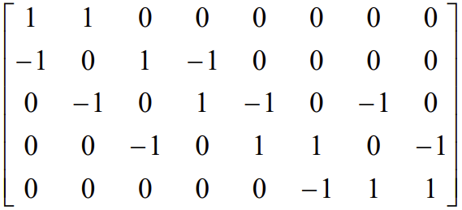
&emsp;&emsp;对于网络中的权，也可以通过对关联矩阵的扩展来表示。例如，如果网络中每条弧有一个权，我们可以把关联矩阵增加一行，把每一条弧所对应的权存储在增加的行中。如果网络中每条弧赋有多个权，我们可以把关联矩阵增加相应的行数，把每一条弧所对应的权存储在增加的行中。

(3) 弧表表示法
&emsp;&emsp;弧表表示法将图以弧表$(arc \ list)$的形式存储在计算机中。所谓图的弧表，也就是图的弧集合中的所有有序对。弧表表示法直接列出所有弧的起点和终点，共需$2m$个存储单元，**因此当网络比较稀疏时比较方便**。此外，对于网络图中每条弧上的权，也要对应地用额外的存储单元表示。例如2所示的图，假设弧$(1,2)，(1,3)，(2,4)，(3,2)，(4,3)，(4,5)，(5,3)$和$(5,4)$上的权分别为$ 8，9，6，4，0，3，6 $和$ 7$，则弧表表示如表 1所示。
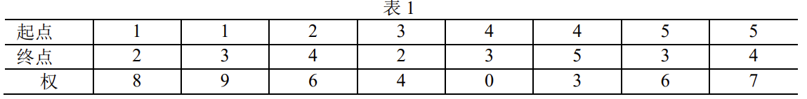

(4) 邻接表表示法
&emsp;&emsp;邻接表表示法将图以邻接表$(adjacency lists)$的形式存储在计算机中。所谓图的邻接表，也就是图的所有节点的邻接表的集合；而对每个节点，它的邻接表就是它的所有出弧。邻接表表示法就是对图的每个节点，用一个单向链表列出从该节点出发的所有弧，链表中每个单元对应于一条出弧。为了记录弧上的权，链表中每个单元除列出弧的另一个端点外，还可以包含弧上的权等作为数据域。图的整个邻接表可以用一个指针数组表示。例如，图2所示的图，邻接表表式为：
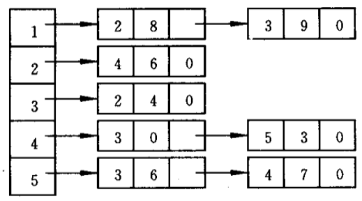

&emsp;&emsp;这是一个 5 维指针数组，每一维（上面表示法中的每一行）对应于一个节点的邻接表，如第 1 行对应于第 1 个节点的邻接表（即第 1 个节点的所有出弧）。每个指针单元的第 1 个数据域表示弧的另一个端点（弧的头），后面的数据域表示对应弧上的权。如第 1 行的“2”表示弧的另一个端点为 2 (即弧为(1,2))，“8” 表示对应弧 (1,2) 上的权为 8 ；“3” 表示弧的另一个端点为 3 (即弧为(1,3)) ，“9” 表示对应弧 (1，3) 上的权为 9 。

（5）星形表示法
&emsp;&emsp;对每个节点，它也是记录从该节点出发的所有弧，但它不是采用单向链表而是采用一个单一的数组表示。也就是说，在该数组中首先存放从节点 1 出发的所有弧，然后接着存放从节点 2 出发的所有孤，依此类推，最后存放从节点 $n$ 出发的所有孤。对每条弧，要依次存放其起点、终点、权的数值等有关信息。相当于对所有弧给出了一个顺序和编号，只是从同一节点出发的弧的顺序可以任意排列。此外，**为了能够快速检索从每个节点出发的所有弧，一般还用一个数组记录每个节点出发的弧的起始地址（即弧的编号）**。在这种表示法中，可以快速检索从每个节点出发的所有弧，这种星形表示法称为前向星形（forward star）表示法。
&emsp;&emsp;在例 7 所示的图中，仍然假设弧$(1,2),(1,3),(2,4),(3,2),(4,3),(4,5),(5,3)和(5,4)$上的权分别为$ 8，9，6，4，0，3，6 $和 $ 7$ 。此时该网络图可以用前向星形表示法表示为表 2 和表 3 。
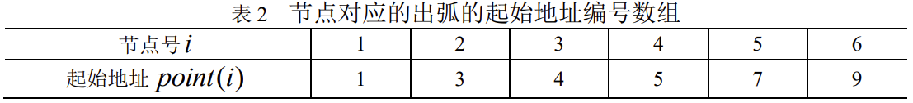
表2中的起始地址就是指表3中的起点，节点号指第一个新节点的弧编号。

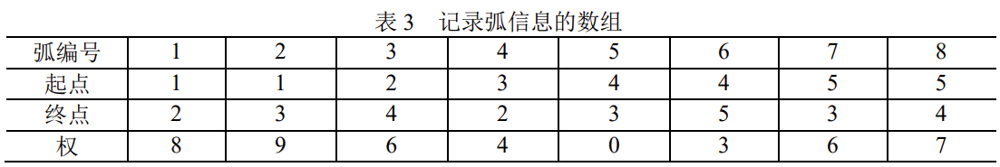
&emsp;&emsp;表2数组设为$point$数组，在数组$point$中，其元素个数比图的节点数多 1（即$n =1$），且一定有$point(1) =1$，$point(n +1) = m +1$。对于节点$i$，其对应的出弧存放在弧信息数组的位置区间为$[point(i), point(i +1) -1]$，如果$point(i) = point(i+1)$，则节点$i$没有出弧。这种表示法与弧表表示法也非常似。
&emsp;&emsp;前向星形表示法有利于快速检索每个节点的所有出弧，但不能快速检索每个节点的所有入弧。为了能够快速检索每个节点的所有入孤，可以采用反向星形$（reverse star）$表示法：首先存放进入节点 1 的所有孤，然后接着存放进入节点 2 的所有弧，依此类推，最后存放进入节点n的所有孤。对每条弧，仍然依次存放其起点、终点、权的数值等有关信息。同样，为了能够快速检索从每个节点的所有入弧，我们一般还用一个数组记录每个节点的入孤的起始地址（即弧的编号）。例如，例 7 所示的图，可以用反向星形表示法表示为表 4 和表 5。
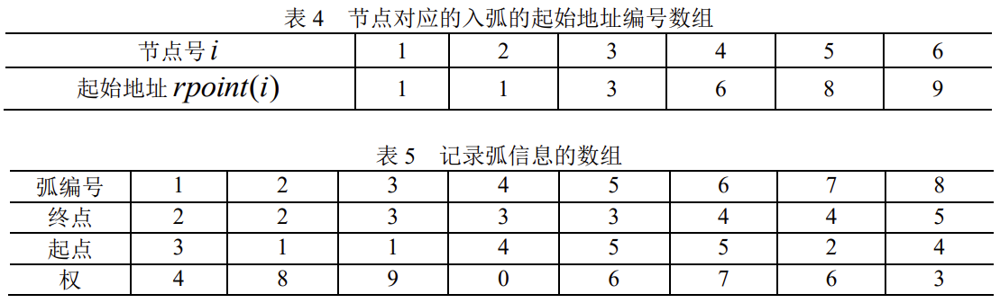

###7. 轨与连通
&emsp;&emsp;$W =v_0e_1v_1e_2...e_kv_k$，其中$e_i \in E(G) ,1 \le i \le k ,v_j \in V(G),0 \le j \le k ， e_i$与$v_{i-1},v_i$关联，称$W$是图$G$的一条道路(walk)，$k$为路长，顶点$v_0$和$v_k$分别称为$W$的起点和终点，而$v_1,v_2,...,v_{k-1}$称为它的内部顶点。

&emsp;&emsp;若道路$W$的边互不相同，则$W$称为迹(trail)。若道路$W$的顶点互不相同，则$W$称为轨(path)。
&emsp;&emsp;称一条道路是闭的，如果它有正的长且起点和终点相同。起点和终点重合的轨叫做圈(cycle)。
&emsp;&emsp;若图$G$的两个顶点$u,v$间存在道路，则称$u$和$v$连通(connected)。$u,v$间的最短轨的长叫做$u,v$间的距离。记作$d(u,v)$。若图$G$的任二顶点均连通，则称$G$是连通图。
显然有：
(i) 图$P$是一条轨的充要条件是$P$是连通的，且有两个一度的顶点，其余顶点的度为 2；
(ii) 图$C$是一个圈的充要条件是$C$是各顶点的度均为 2 的连通图。

